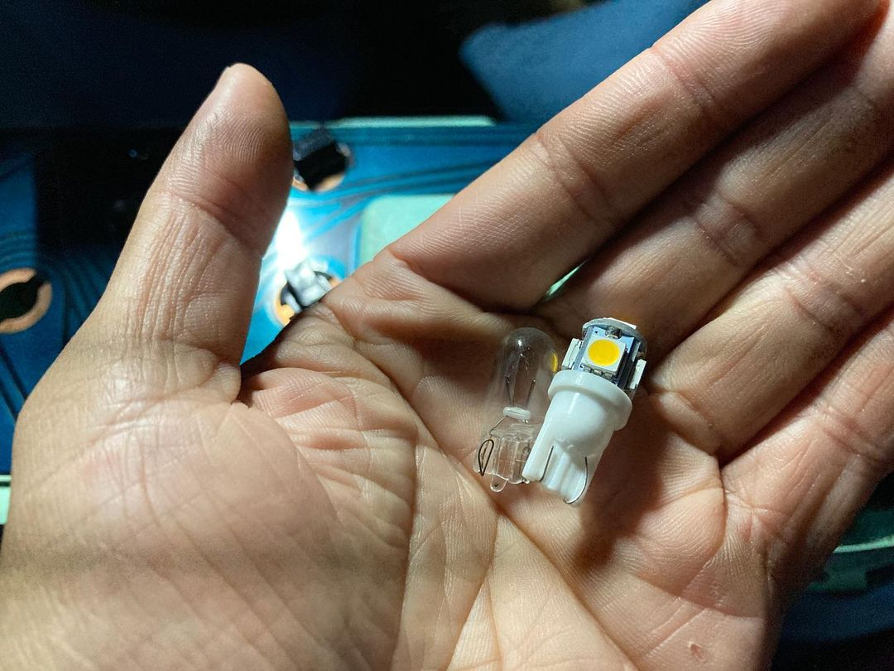
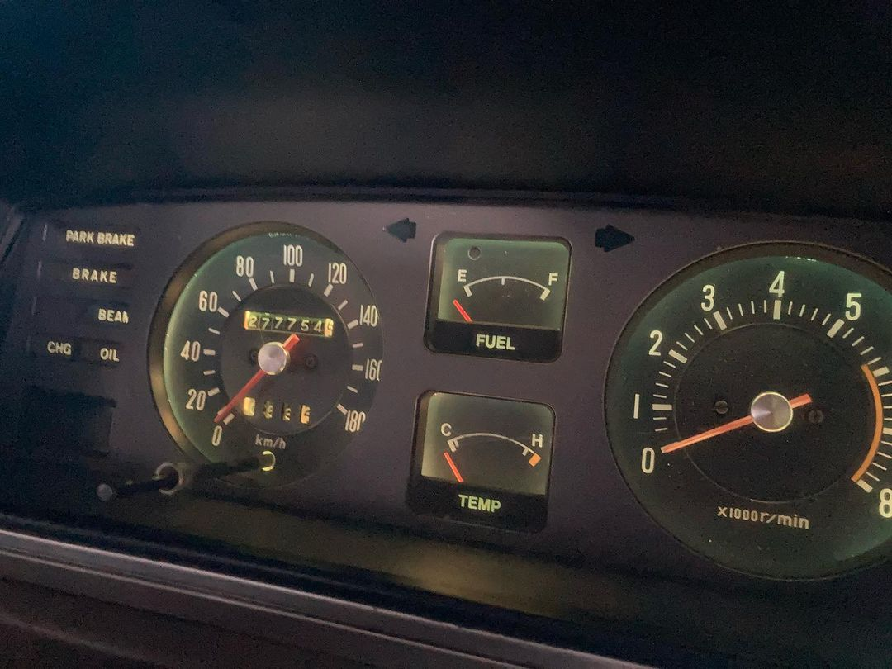
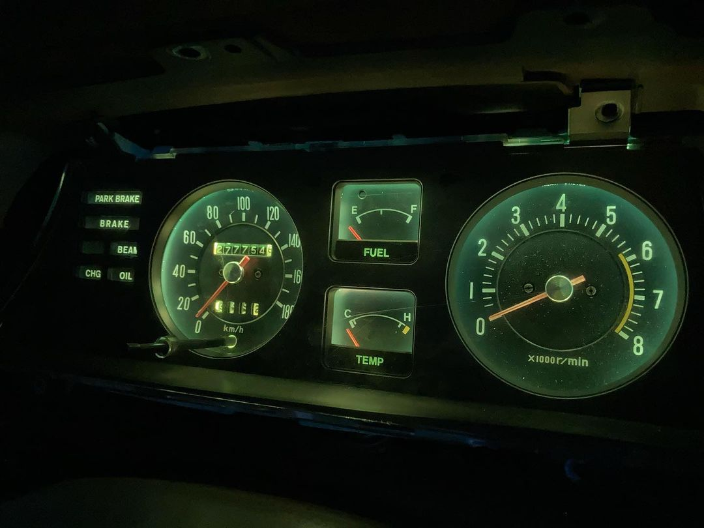
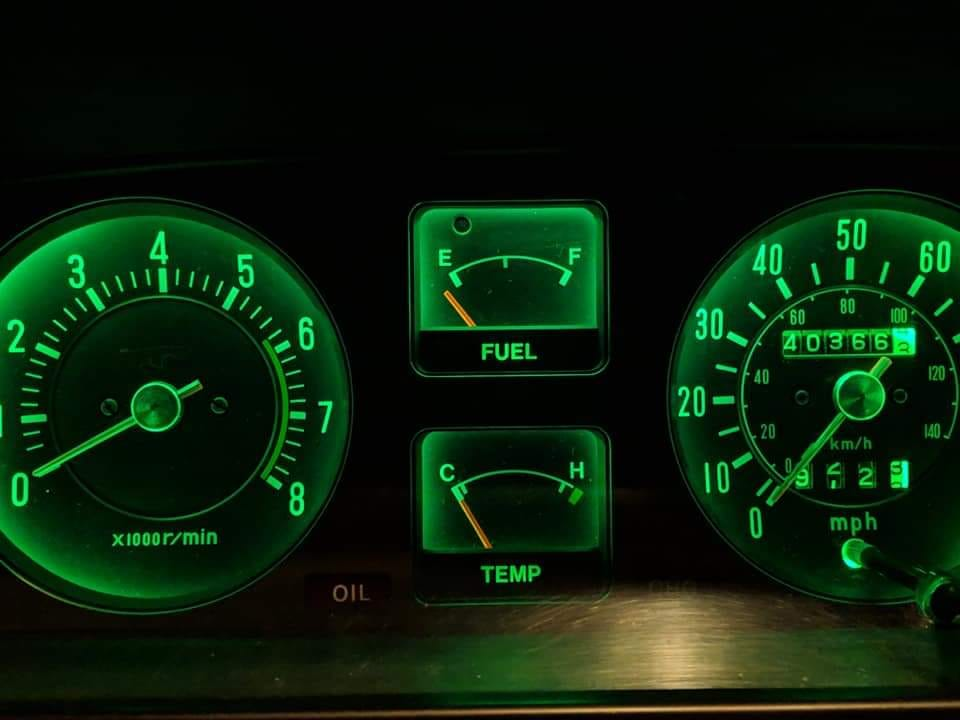

# Dashboard

[TOC]

---

## Bulbs

!!! warning "Changing colour"
    - The stock cluster lighting areas are tinted green
    - Tint must be removed to independently alter colour

!!! info "Key Information"
    - Stock bulb base: 194/168 wedge (clear)
    - LED replacement: T10 wedge

#### Halogen (left), LED (right)

_Source: [@ocampus](https://www.instagram.com/p/B_rJUUqHfcD/)_

### Halogen

_Source: [@ocampus](https://www.instagram.com/p/B_rJUUqHfcD/)_

### LED

!!! warning
    - Brightness and spread will vary depending on LED design

#### Clear

_Source: [@ocampus](https://www.instagram.com/p/B_rJUUqHfcD/)_

#### Green

_Source: [Zach Tayson](https://www.facebook.com/groups/216354961906562/posts/1284422345099813/)_
