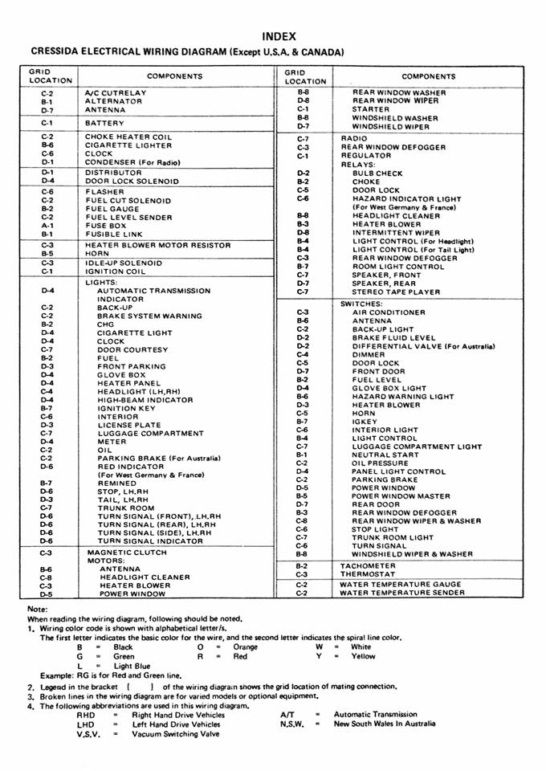
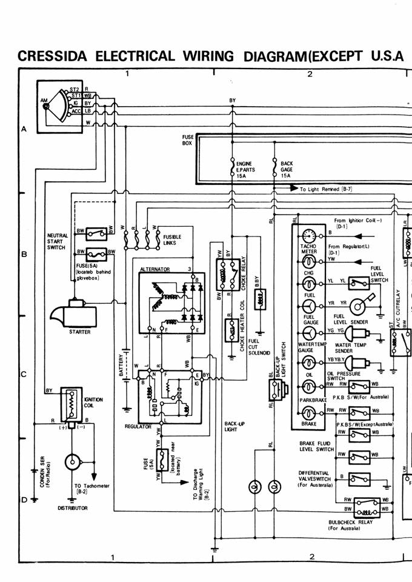
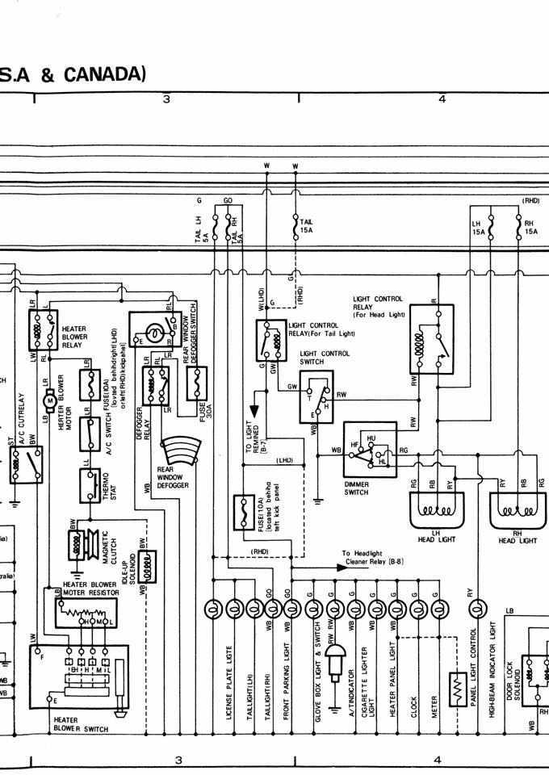
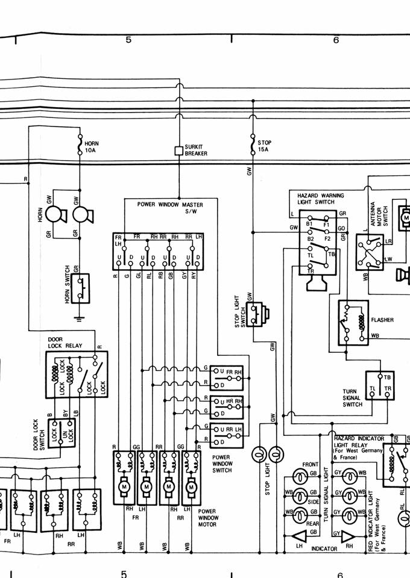
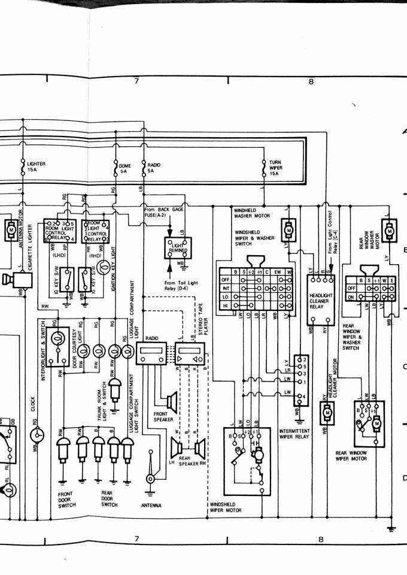

# Wiring

#### Related Content

- [Dashboard](./dashboard.md)

#### Table of Contents

[TOC]

---

## Diagrams

### Factory

!!! quote
    After tracing a loom and amending a factory diagram I found this more accurate factory diagram that confirms a lot of my amendments, but is still not 100% accurate.

    _- [Joel Swinnerton](https://www.facebook.com/groups/216354961906562/posts/915335388675179/)_

_Source: [Joel Swinnerton](https://www.facebook.com/groups/216354961906562/posts/915335388675179/)_

### Engine swaps

- [wilbo666's Wiki page](http://wilbo666.pbworks.com/w/page/116359153/Wiki%20-%20wilbo666) has always been the best resource for wiring diagrams and more
- Pinouts and descriptions have been carefully procured
- The site includes many popular Toyota engines such as:
    - 1JZ-GTE
    - 2JZ-GTE/GE
    - 1UZ-FE
    - 5M-GE
    - 6M-GE
