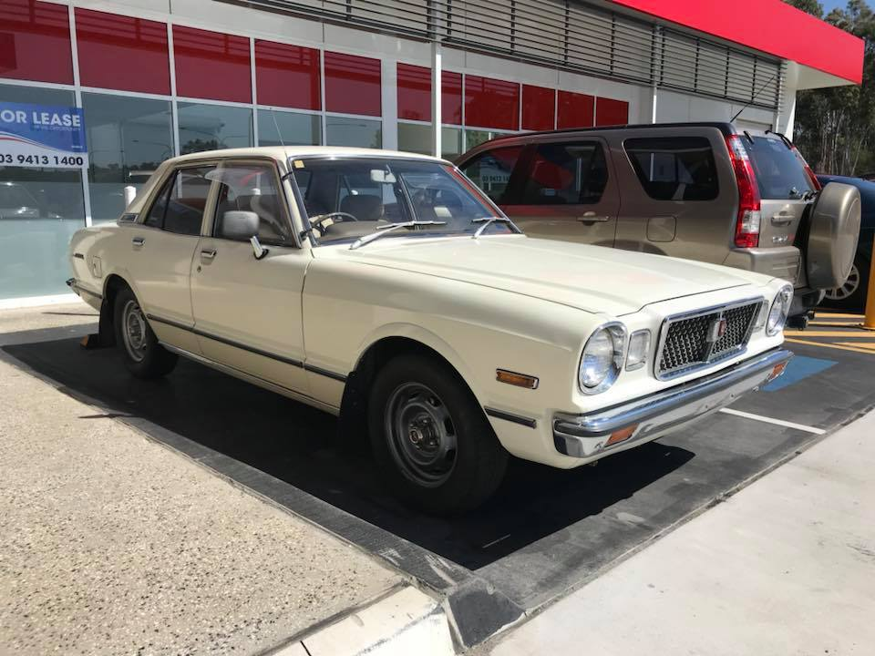

# Exterior

#### Table of Contents

[TOC]

---

!!! info "Key Information"
    - Series 1: 1976-1978
    - Series 2: 1978-1980

## Toyota/Toyopet Cressida/Mark II

### Series 1 - Australia

_Source: [Wong Ka Leung](https://www.facebook.com/groups/216354961906562/posts/867024680172917/)_

_Source: [Wong Ka Leung](https://www.facebook.com/groups/216354961906562/posts/867024686839583/)_

### Series 1 - Japan

!!! example "Unique parts"
    - Front and rear bumper metal overriders
    - Powered fender mirrors
    - 'Grande' grille badge
    - 'EFI' grille badge
    - Alternate grille also available
    - License plate garnish
    - 'Toyopet' boot trim
    - 'Corona Mark II' rear guard badges

_Note: Grande trim pictured_

_Source: [Goonet](https://www.goo-net-exchange.com/usedcars/TOYOTA/MARK_II/700951016430201129001/index.html)_

_Source: [Jack Nyland](https://www.facebook.com/groups/216354961906562/posts/499829773559078/)_

### Series 1 - North America

!!! example "Unique parts"
    - Front and rear bumper plastic overriders
    - Park bench front and rear bumpers (different to [Series 2 JP](#series-2-jp))
    - Rear license plate light
    - Side markers

_Source: [Meekzilla Paul](https://www.facebook.com/groups/216354961906562/posts/1639019792973398/)_

_Note: Side moulding has been removed on this example_

_Source: [Meekzilla Paul](https://www.facebook.com/groups/216354961906562/posts/1340269992848381/)_
