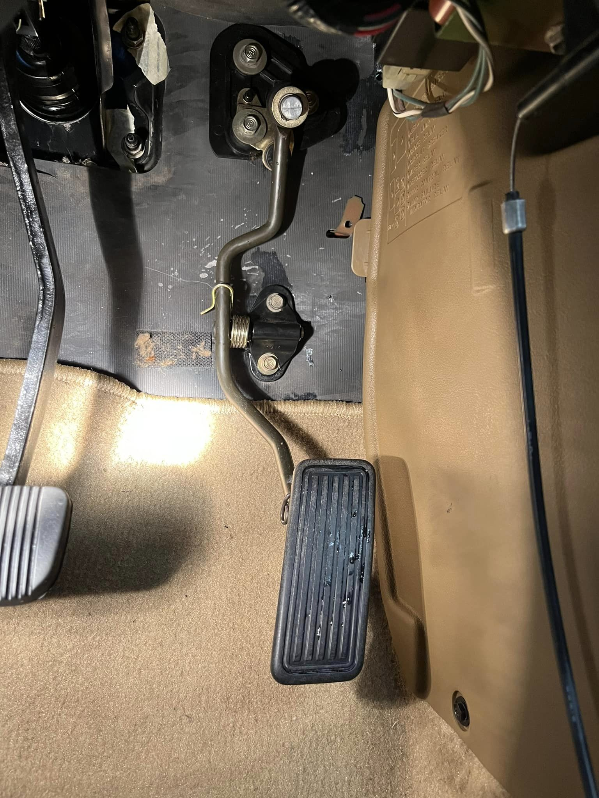
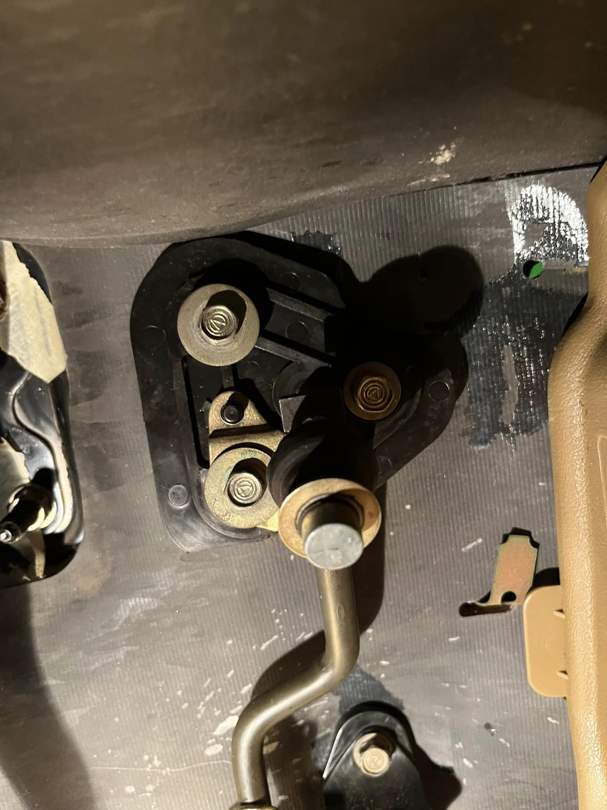
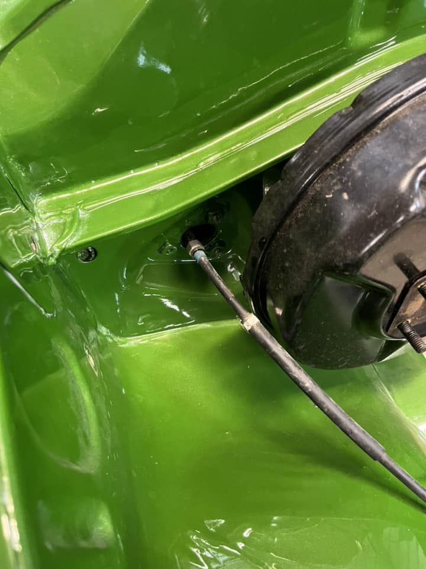
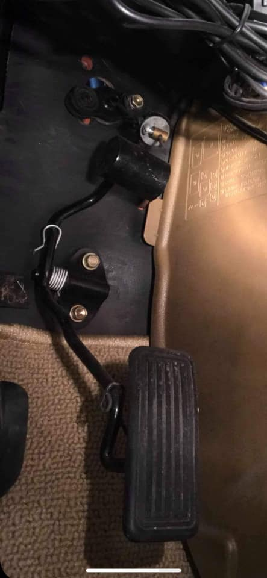

# Accelerator Pedal

#### Table of Contents

[TOC]

---

## MX62 Cressida Series 2 (ADM)

!!! quote
    - Direct bolt in to MX32
    - Gives you a cable instead of the linkage setup
    - Good for engine conversion or aftermarket carby

    _- [Jordy Taylor](https://www.facebook.com/groups/216354961906562/posts/2327299850812052/)_

_Source: [Jordy Taylor](https://www.facebook.com/groups/216354961906562/posts/2327299850812052/)_

## MX83 Cressida

!!! quote
    MX83 pedal also works if you bend the pedal a touch

    _- [Mitch Conroy](https://www.facebook.com/groups/216354961906562/posts/2327299850812052/?comment_id=2327634337445270)_

!!! quote
    Yer mx83 can work also. But only one bolt hole can be used where cable goes through the firewall. pedal bolts up to firewall with both holes but pedal needs to be bent."

    _- [Jordy Taylor](https://www.facebook.com/groups/216354961906562/posts/2327299850812052/?comment_id=2327636297445074)_

_Source: [Jordy Taylor](https://www.facebook.com/groups/216354961906562/posts/2327299850812052/?comment_id=2327636297445074)_
