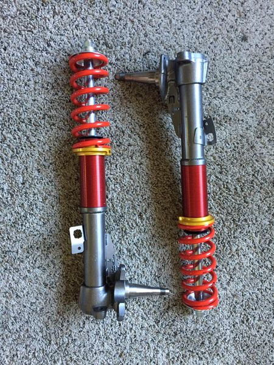

# Coilovers

[TOC]

---

## Front Coilovers

:warning: **Warning:** Stub axles must be welded to _most_ aftermarket coilovers

:key: **Key Information:**

- Bolt spacing: `90mm`

### Options

:heart: **Bolt in:**

[TechnoToyTuning (T3) for MX32 Cressida](https://technotoytuning.com/toyota/mx32/front-coilover-conversion-mx32-cressida)

- May come with stub axles pending stock
- Custom spring rate available

_Credit: [Jimmy Conway](https://www.facebook.com/groups/216354961906562/posts/519522961589759/)_

:broken_heart: **Requires modification:**

[BC Racing for MX73 Cressida](https://bcracing.com.au/collections/toyota-cressida-mx73-85-88)

- Strut top holes must be slightly massaged
- Camber plates will sit on a 45 degree angle
- Requires a shorter spring or coilover casing to go super low

---

## Rear Shocks

- AE86
- Camaro (year unknown)

---

## Rear Springs

- S14
- R33
- RA60

_Last edited {{ git_revision_date }}_
