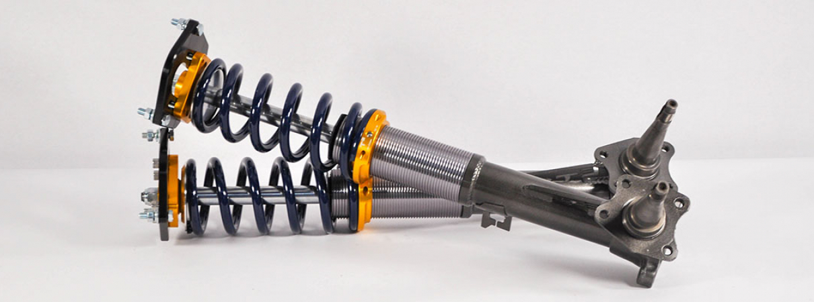
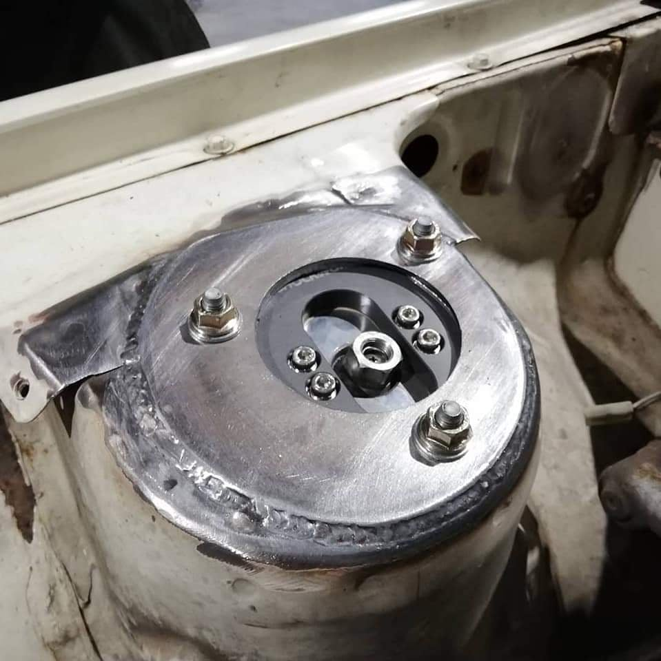
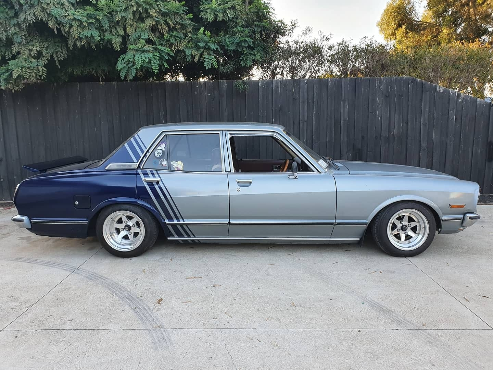
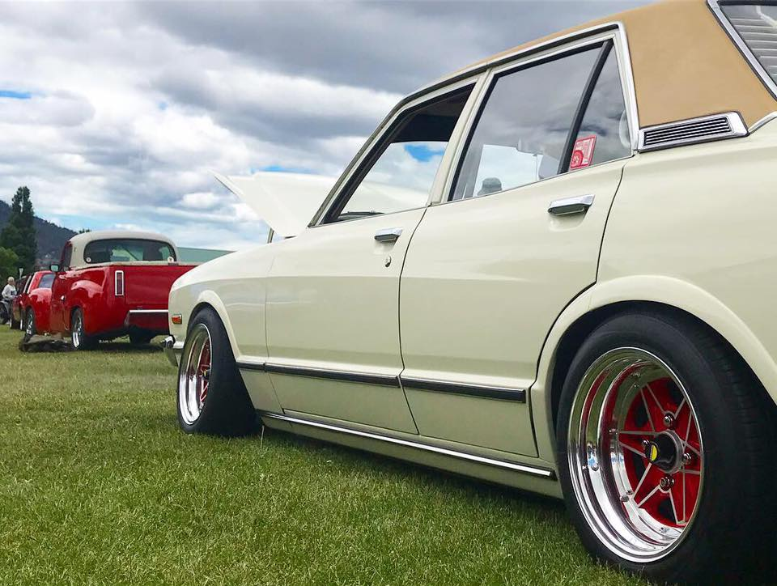

# Coilovers

[TOC]

---

## Front Coilovers

!!! warning "Requires welding"
    - Stub axles must be cut from your existing shocks
    - Stub axles need to be welded to _most_ coilover casings

!!! info "Key Information"
    - Lower bolt spacing: `90mm`

###  MX32 Cressida

- Offered by [TechnoToyTuning](https://technotoytuning.com/toyota/mx32/front-coilover-conversion-mx32-cressida)
- Strut tower holes don't require modification
- May come with stub axles pending stock
- Custom spring rate available

### MX73 Cressida

- Strut tower holes must be elongated
- Camber adjustment will sit on a 45 degree angle
- Requires a shorter spring or coilover casing to go super low

### S13 Silvia (camber tops)

- Strut tower holes must be elongated

!!! quote
    We moved my top back, but that's X32 pattern with the holes drilled out. Should be able to just open up two of the holes bigger, or you can do all three.

    _- [@dooogs73](https://www.instagram.com/dooogs73/)_

---

## Rear Shocks

### Sedan (solid axle)

| Model | Extended length (mm) | Compressed length (mm) | Source |
| --- | --- | --- | --- |
| AE86 | 560 | 335 | [driftke70](http://www.ae86drivingclub.com.au/forums/archive/index.php/t-1115.html) |
| AE86 (Tokico HTS) | 455 | 307.5 | [driftke70](http://www.ae86drivingclub.com.au/forums/archive/index.php/t-1115.html), [Fredrik Sørlie](https://www.facebook.com/groups/216354961906562/posts/1183357231872992/?comment_id=1183359665206082) |
| 82-92 Camaro | 486 | 309 | [driftke70](http://www.ae86drivingclub.com.au/forums/archive/index.php/t-1115.html), [Dustin Cash](https://www.facebook.com/groups/216354961906562/posts/1419203754955004/) |
| 94 Camaro V6 | ??? | ??? | [Jason Peliska](https://www.facebook.com/groups/216354961906562/posts/1419203754955004?comment_id=1419210288287684)
| T/RA63 | 620 | 320 | [driftke70](http://www.ae86drivingclub.com.au/forums/archive/index.php/t-1115.html) |

---

## Rear Springs

### Sedan (solid axle)

#### S14/R33 Skyline (rear)

!!! quote
    I cut more off the s14 low springs and fitted canter shocks. Its functional, not comfortable

    _- [Josh Tomlinson](https://www.facebook.com/groups/216354961906562/posts/1265660170309364?comment_id=1265664563642258&reply_comment_id=1265674826974565)_

_Source: [Josh Tomlinson](https://www.facebook.com/groups/216354961906562/posts/1265660170309364?comment_id=1265664563642258&reply_comment_id=1265674826974565)_

!!! quote
    R33 kings chopped a bit work well in the rear, surprisingly smooth

    _- [Matthew Long](https://www.facebook.com/groups/216354961906562/posts/1265660170309364/?comment_id=1265686413640073)_

_Source: [Matthew Long](https://www.facebook.com/groups/216354961906562/posts/1023936224481761?comment_id=1023948557813861)_
