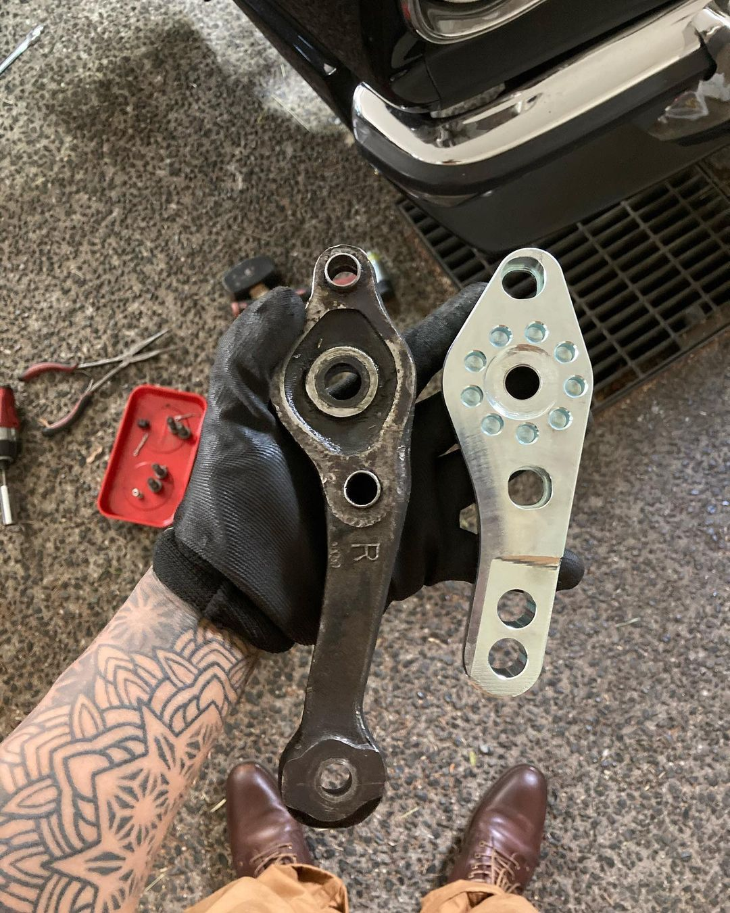
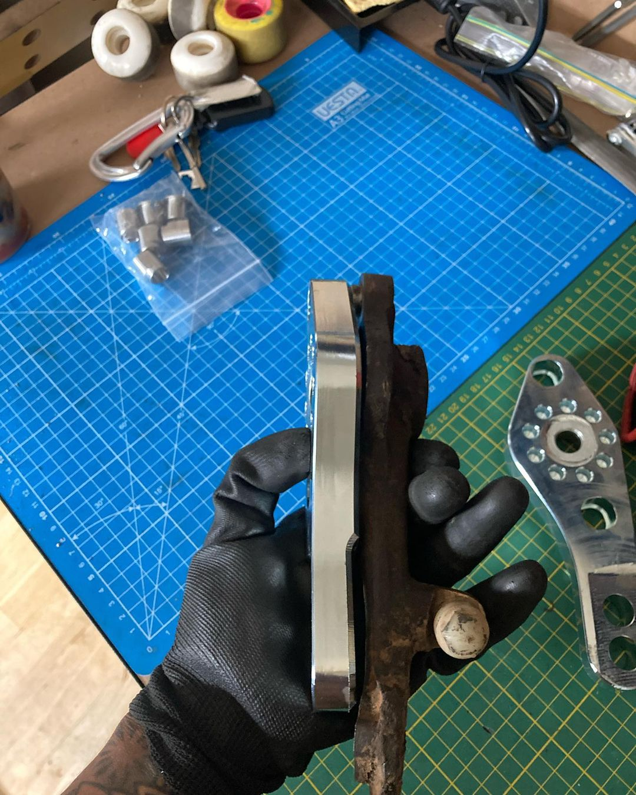
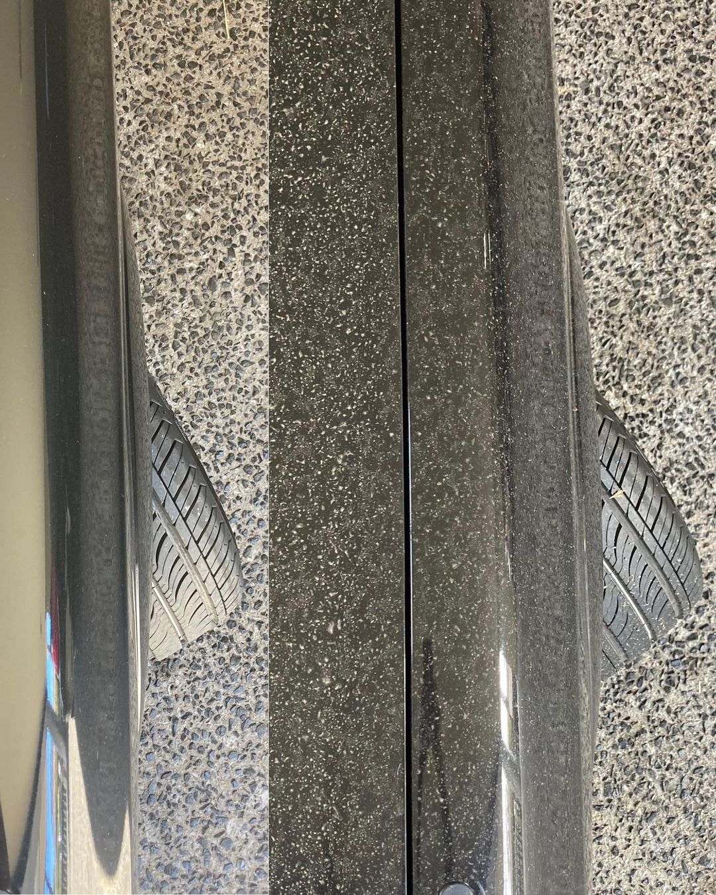

# Lower Control Arms

#### Related Content

- [Front Coilovers](front-coilovers.md)
- [Rear Shocks](rear-shocks.md)
- [Rear Springs](rear-springs.md)

#### Table of Contents

[TOC]

---

!!! warning
    - Factory lower control arms have bump stomps
    - Bump stops can be removed for more angle

!!! info "Key Information"
    - Bolt spacing: `90mm`

## TechnoToyTuning (T3)

- [Super evolved model](https://technotoytuning.com/toyota/mx32/super-evolved-knuckles-outer-tie-rods-just-about-every-old-school-toyota)
- Fits `85mm, 87mm and 90mm` strut casings
- Sleeve included to adapt smaller ball joints
- Suits aftermarket and factory outer tie rods
- Adjustable ackerman
- Adjustable 'steering reaction'

_Note: Stock vs T3 pictured (factory bump stops)_

_Source: [@ocampus](https://www.instagram.com/p/CIP9Wi_Hkju/)_
