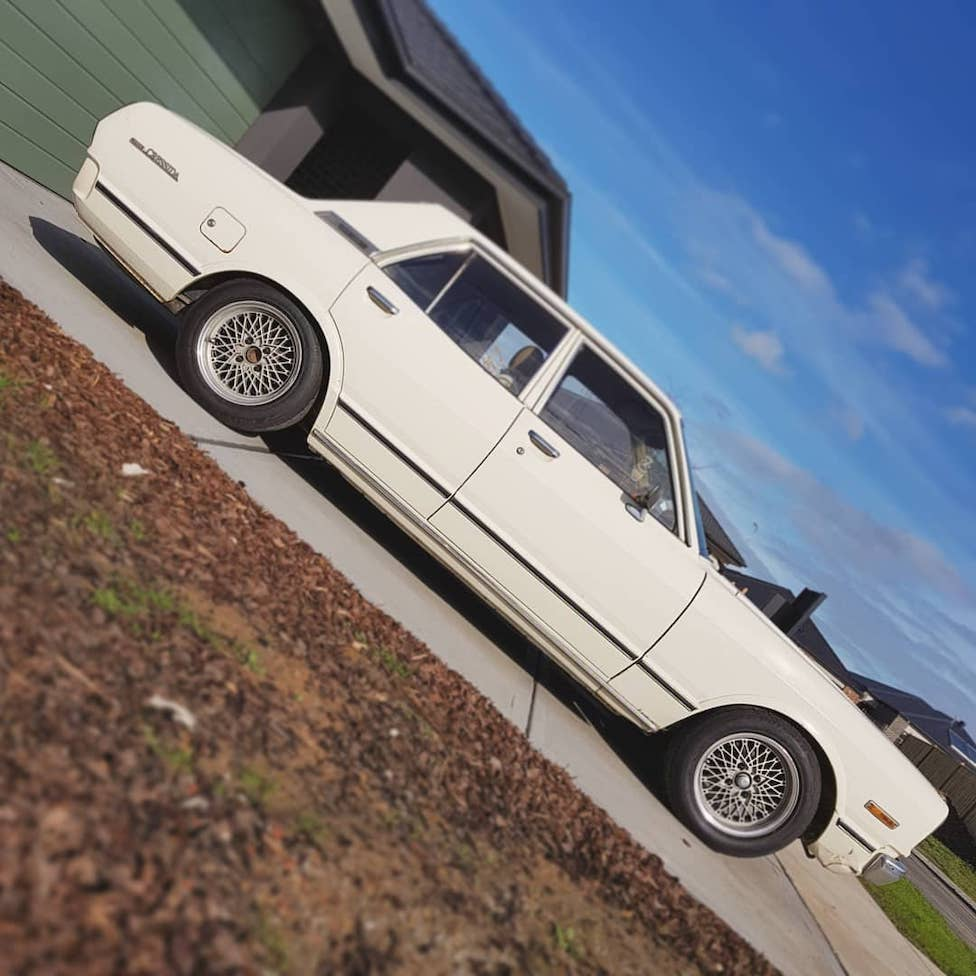

# Rear Springs

#### Related Content

- [Front Coilovers](front-coilovers.md)
- [Steering Arms](steering-arms.md)
- [Rear Shocks](rear-shocks.md)

#### Table of Contents

[TOC]

---

## Sedan (solid axle)

!!! info "Key Information"
    - Free height: 415mm
    - Top OD: 134mm
    - Top ID: 108mm
    - Bottom OD: 109mm
    - Bottom ID: 85mm
    - _Source: [Clint Castellano](https://www.facebook.com/notes/x3-chassis-cressida-club/x3x4-cressidamark-iichaser-faq/677056622503058/)_

### MX73 Cressida (rear)

!!! quote
    - Spring does not completely fit on the perch but it works
    - Comfortable enough

    _- [@ocampus](https://www.instagram.com/ocampus/)_

_Source: [@ocampus](https://www.instagram.com/p/B0a07ZOHYd3/)_

### S14/R33 Skyline (rear)

!!! quote
    I cut more off the s14 low springs and fitted canter shocks. Its functional, not comfortable

    _- [Josh Tomlinson](https://www.facebook.com/groups/216354961906562/posts/1265660170309364?comment_id=1265664563642258&reply_comment_id=1265674826974565)_

_Source: [Josh Tomlinson](https://www.facebook.com/groups/216354961906562/posts/1265660170309364?comment_id=1265664563642258&reply_comment_id=1265674826974565)_

!!! quote
    R33 kings chopped a bit work well in the rear, surprisingly smooth

    _- [Matthew Long](https://www.facebook.com/groups/216354961906562/posts/1265660170309364/?comment_id=1265686413640073)_

_Source: [Matthew Long](https://www.facebook.com/groups/216354961906562/posts/1023936224481761?comment_id=1023948557813861)_

### RA60 Celica (rear)

!!! quote
    My springs front and rear are ra60 they go straight in. Rides fine for springs

    _- [Matthew Sammut](facebook.com/matthew.sammut.927)_

_Source: [Matthew Sammut](facebook.com/matthew.sammut.927)_

!!! quote
    Yeah I have ra60 king springs in the rear and it rides and sits fine

    _- [@lozzz_3000](https://www.instagram.com/lozzz_3000/)_

_Source: [@lozzz_3000](https://www.instagram.com/p/BlfbZiEAzYq)_
