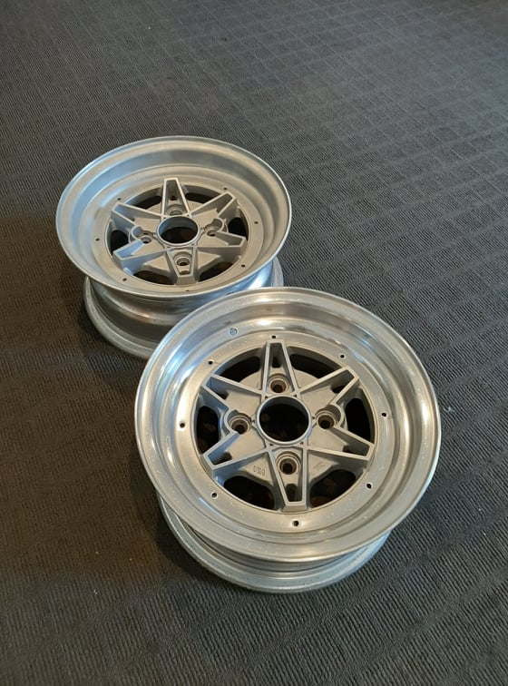

# Refurbishing Wheels

#### Related Content

- [Tyres](tyres.md)

#### Table of Contents

[TOC]

---

##  Guide by [dooogs73](https://www.instagram.com/dooogs73/)

_Note: All images have been provided by dooogs73_

!!! example "Materials used"
    - Various scouring pads (up to 1200 grit)
    - Polishing kit with buffing wheel
    - Drill
    - Liquid Reflection
    - Jack stands
    - Jack
    - Wheel chock

### Preparation

- Ensure you have the materials specified above
- Remove all hardware from your wheels
- Put your car on jack stands (depending on drivetrain configuration)
- Ensure your 'drive' wheels are off the ground

### Process

- Remove existing wheels
- Mount the wheel to be refurbished
- Start the car and put it in gear so the wheels are freely spinning
- Wet the _lowest grit_ scouring pad

!!! quote
    I think the soap pads/steel wool are a god send with water. Doesn't seem to be as slow as sanding/doesn't clog as fast

    _- [@dooogs73](https://www.instagram.com/dooogs73/)_

- Polish the lip until you're happy
- Move on to the next higher grit _until 1200 grit_
- Turn off the car and remove the wheel

- Attach the buffing wheel to your drill
- Apply polish from kit and buff
- Apply Liquid Reflection

### Result

